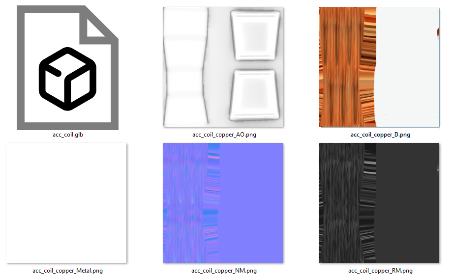
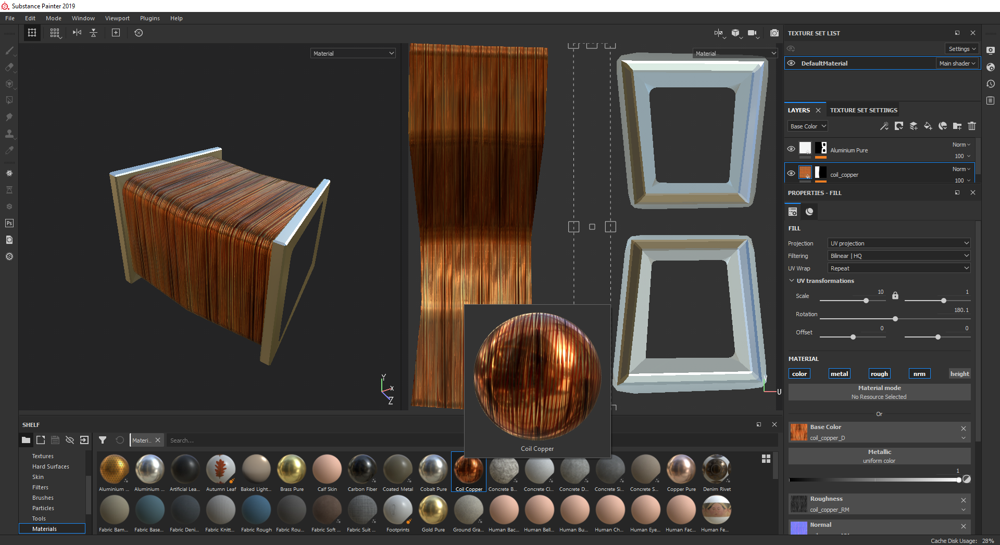
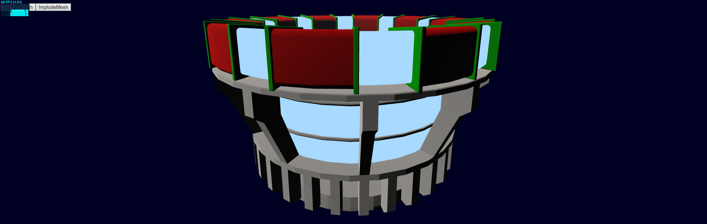
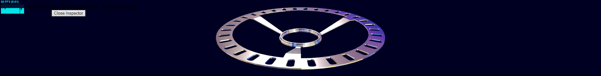

# Final Report

The aim of this report is to describe in detail the main interesting aspects of our implementation. 

## **1** &thinsp; Assets creation: 3D Model and first material
In order to practice in **3D modeling** and in the use of tools like 
[Blender](https://www.blender.org/) and [Substance Painter](https://www.substance3d.com/), 
we choose to create our own 3D model (and materials) of the first iteration of the 
**ARC reactor** (that can be seen in the 
[Iron Man movies](https://it.wikipedia.org/wiki/Iron_Man_(film))): 
the choice of this particular subject was made for its semplicity (by a model complexity 
point of view) and its aesthetic appeal.

The model is composed by the following components:
1.  **acc_coil**: the "prototype" for the 10 copper coils that make the top "ion accelerator" 
(togheter with the `acc_ring` mesh), we chose to make a single one of them and then exploit 
instancing to make the other nine, in order to reduce the computational pressure on the 
application stage;
2.  **acc_ring**: part of the top "*ion accelerator*", it is basically a square toroid. 
This part will use an emissive material in order to give the impression of light emission;
3.  **chamber**: the central part of the ARC reactor and this also will use an emissive 
material (according to the reference pictures of the real ARC reactor);
4.  **chamber_heatsink**: a little heatsink, positioned on the top of the `chamber`;
5.  **hamber_rigs**: metal rings that support the `chamber` (like the ring of a barrel);
6.  **grid**: it's basically a round metal grid with a slight curvature. 
It is positioned in the center of the model just below the `inner_copper_rings` component;
7.  **inner_copper_rings**: thick copper rings with two steel sustainers;
8.  **inner_structure**: the structure that contains the palladium ring for the nuclear fusion reaction;
9.  **structure**: finally this is the main structure of the reactor which contains all the other parts.

<br/><br/>

<div style="text-align: center;"><strong>Image 1</strong> - <em>The first model (where all parts are grouped together in a single mesh), 
this is mainly a test to see how the final result must look like
(and how the 10 coils stands together)</em></div>
<br/><br/>


<div style="text-align: center;"><strong>Image 2</strong> - <em>The second model (splitted in the 9 components) with a single coil</em></div>
<br/>

The next thing to do was the creation of a **custom material** for the coils to give the 
impresion of a real copper coil (it would have been very difficult and unefficient to model 
the single copper wires): to achieve that we use two software tools 
([ShaderMap](https://shadermap.com/home/) and [Substance Painter](https://www.substance3d.com/)) 
to create a set of texture for a copper coil and then we have applied a Substance Painter's **smart material** on the model in order to bake 
the final textures to be used in `threejs`.

The process is, basically, the following:
1.  Import a copper coil texture in ShaderMap as **diffuse color**;
2.  Using ShaderMap to **generate all the other textures** for the material (`normal map`, 
`displacement map`, `specular map`, etc.);
3.  Import theese textures on Substance Painter and **create a new smart material** preset with them;
4.  **Apply the copper coil material** on the center part of the coil model 
**and a simple alluminium material on the rest of the model** (this was done using a 
`color id map` generated by assigning different `vertex color` to the two part of the mesh in Blender);
5.  **Bake and Export** the textures from Substance Painter;

<br/><br/>

<div style="text-align: center;">


<strong>Image 3</strong> - <em>The generated textures</em></div>
<br/><br/>

<div style="text-align: center;">


<strong>Image 4</strong> - <em>Texture application</em></div>
<br/><br/>

---
## **2** &thinsp; Inspector view
> Since we want to provide to the user an interface for the **material selection** for any single component of the model we thought about using a separate view, called the `inspector view`. In that view the users have a better and more detailed visualization of the component to edit.

In order to achieve the component selection, we setted up a `ray caster` which allows the user to click directly on a specific component of the mesh. 
Once a component is selected the application switches the `renderer` form the original scene to a second scene (called `inspectorScene`) that contains only the element of interest.

Thanks to the setup-file `architecture.json` we can specify a custom scaling for each component to be clearly visibile in the `inspector view` (and to make all the elements look almost the same dimension when inspected).

In order to update the `inspected object` material we have implemented another scene with some cubes dressed with different material choices (thanks to a `ray cast` is enough to click on a cube to update the component material). Using a sort of event paradigm we were able to **exchange events with the two scenes** and also to bind the camera rotation of the inspector scene with the cubes rotation. 

<br/><br/>

---
## **3** &thinsp; Material shaders

For the implementation of the **shaders** we had to make some differt vertex/fragment couples:
-   **Emissive shader** for the `chamber` and the `acc_ring`;
-   **Custom shader** for the `coils`;
-   **Custom shader** for the `grid`;
-   **Custom shader** for `inner_copper_rings` model;
-   **Metal shader** for the others;
<br/><br/>

### **3.1**&thinsp; Emissive shader
This shader couple is very simple:
-   The **vertex shader** is the basic vertex shader that outputs the position of the vertex in `clip space`;
-   The **fragment shader** simply applies the emissive color to `glFragColor` (with **gamma correction**);


<div style="text-align: center;"><strong>Image 5</strong> - <em>Emissive material alone</em></div>
<br/><br/>


<div style="text-align: center;"><strong>Image 6</strong> - <em>Emissive material with the other parts dressed with a <tt>MeshPhongMaterial</tt></em></div>
<br/><br/>

### **3.2** &thinsp; Metal shader

This shader is a **standard microfacet shader** with no lambertian component (since **we are interested only in the specular component**).
Our implementation also support environment reflections (with adjustable blur according to the roughness of the material) and takes into account the ambient light (in this case the `hemilight` from `THREE.js`).
To obtain this we have divided the computation on the fragment shader in two part:
-   **Direct light calculation**: it implements the classic microfacet shader for a single point light (we don't need more than one light for our scene);
-   **Indirect light calculation**: it takes into consideration the ambient light term and the reflection term given by the environment map; a difficult problem was to obtain differt blurred versions of the envmap for different levels of roughness: since `WebGL 1.0` doesn't support the access to mip map levels natively and, even with the extensions, this feature is still not supported on `Android 6`, the solution was to create 9 different texture images in [GIMP](https://www.gimp.org/), miming the mip map levels on the GPU, and assign the correct one to the `uniforms` of the material based on the roughness value.



<div style="text-align: center;"><strong>Image 7</strong> - <em>Here we can see the result at two different values of roughness</em></div>
<br/><br/>


### **3.3** &thinsp; Other shaders
For the other shaders there isn't much more to say:

-   **coil shader** implements the same **BRDF** as the **metal** one with the difference that **it uses vertex colors to determine which part of the model requires the use of the adequated textures and which not**: in particular for the vertex color **green** it uses basically the metal shader with the `roughness` and `base color` specified in the `uniforms`, while for the other color (**red**) it uses the textures (`diffuse map`, `roughness map` and `normal map`) of the **copper coil material** created with Substance Painter; note that reflections work only for the `green` part since it was impossible to access the correct `mipmap level` of the `environment map` on the `red` part (since the `roughness` vary according to the `roughness map` pixel per pixel);

-   **grid shader** implements the same **BRDF** as the **metal** one, the only difference is that **it uses the `metal map` texture as a mask to determine which pixels are part of the grid and which are inside the holes**: the ones inside the holes are discarded;

-   **inner rings shader** also uses the same **BRDF** as the others but with different parameters for the `vertex color` **blue** (which is always a rough alluminum) and the `vertex color` **purple** (which is configurable via `uniforms`);


<div style="text-align: center;"><strong>Image 8</strong> - <em>Final result, the model with all the shaders applied and the env map as background</em></div>
<br/><br/>

## **4** &thinsp; Mesh architecture and animations

The mesh architecture is specified in the [`architecture.json`](assets/models/architecture.json) file and stores an array of component metadata/properties:

```{json}
{
    "url": "../../assets/models/inner_structure/inner_structure.glb",
    "repeat": 0,
    "inspectorScale": 100,
    "frames": [
        {        
            "scale": 100,
            "position": {
                "x": 0,
                "y": -12,
                "z": 0
            },
            "rotation": {
                "x": 0,
                "y": 0,
                "z": 0
            },
        },
        {        
            ...
        }
    ],
    "materials":[6, 7, 8, 9]
}
```

* `frames` is a vector of states used to specify the initial position of the component (`frames[0]`) and the following steps for the explosion animation (realized using `tween.js`). 
* `materials` is a vector of indices of an array called `materialVector`, that contains the definitions of every `shaderMaterial` used in the application. 

<br/><br/>

## **5** &thinsp; Views

In order to manage the increasing complexity of the multiple views with their own `THREE.js` canvas, we have created a separate file 
for each view (stored in the [views](views/) folder) and integrate them using an `<iframe>` tag.
 
<div style="text-align: center;">


<strong>Image 8</strong> - <em>The final site architecture is the following</em></div>
<br/><br/>


## Future improvements

* An idea to improve the graphic rendering can be to use a post processing effect that **bleeds the emissive color** on the adiacent pixels;
* Try to compress libraries/assets in order to **reduce the loading time**;
* Improve the quality of model design;
* Find envmap that fits better the movie context.
