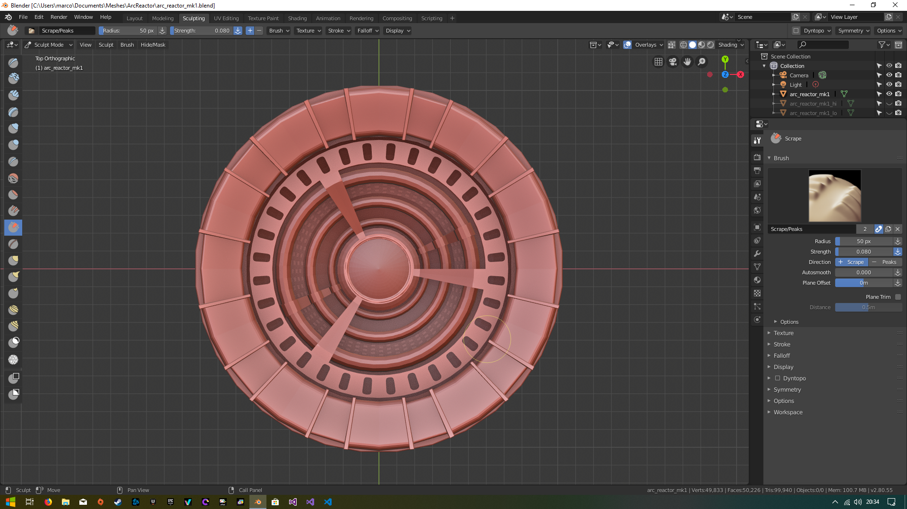
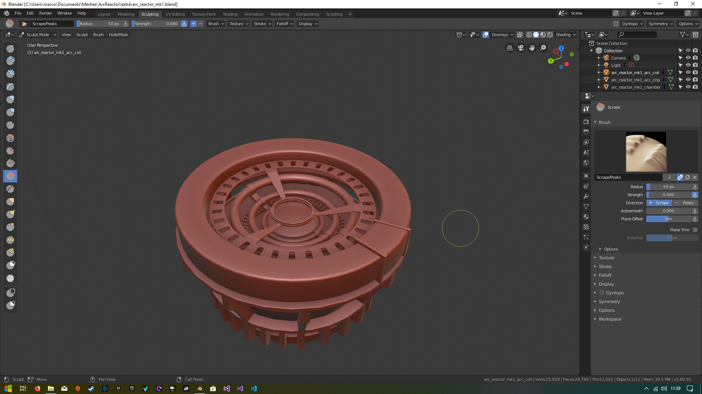
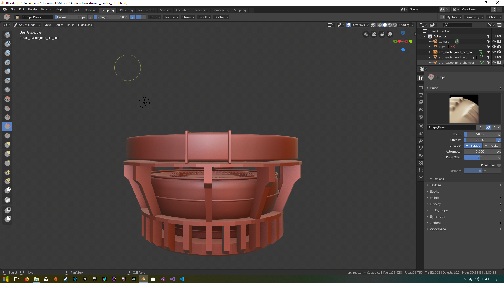
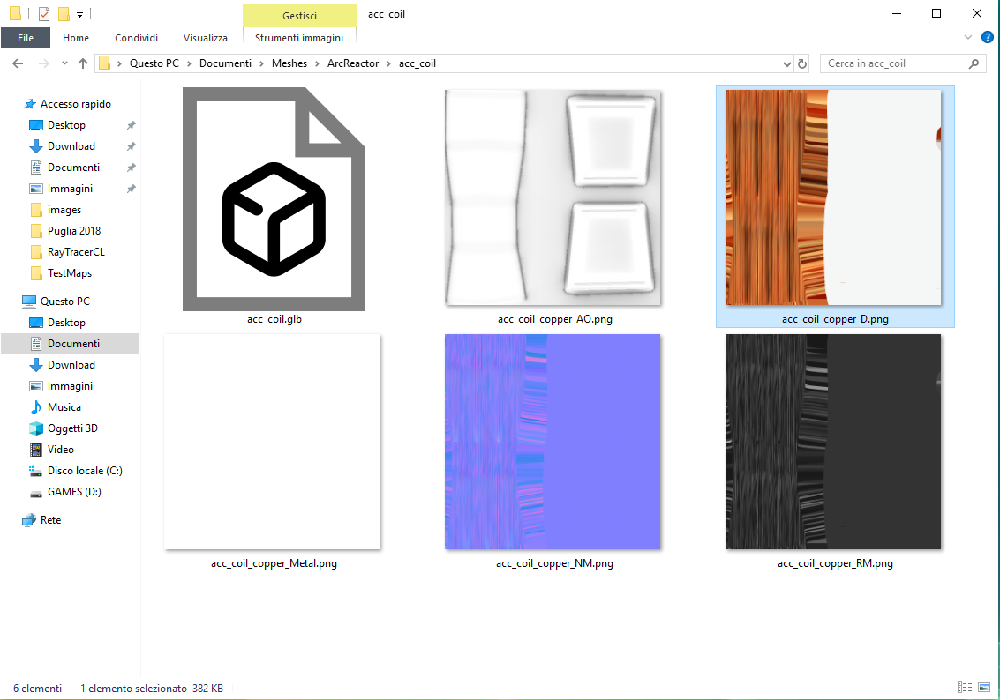
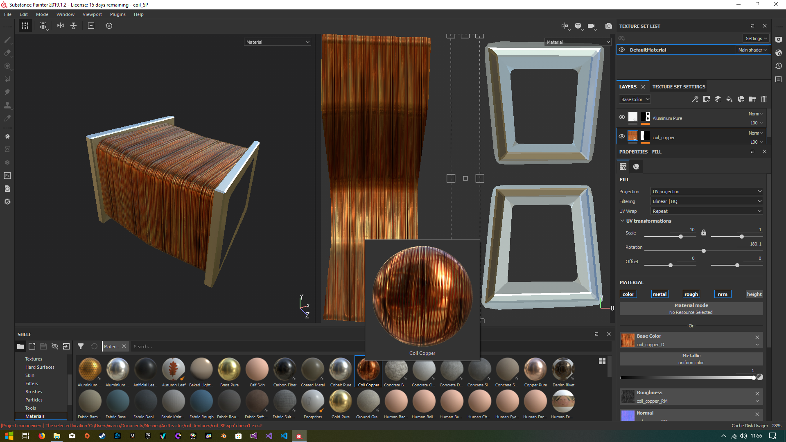

# Journey

## 1. Assets creation: 3D Model and first material
In order to practice in 3D mdelling and in the use of tools like Blender and Substance Painter, we choose to create our own 3D model (and materials) of the first iteration of the ARC reactor that can be seen in the Iron Man movies: the choice of this particular subject was made for its semplicity (by a model complexity point of view) and its aesthetic appeal.

The model is composed by 9 parts:
1.  **acc_coil**: this is the "prototype" for the 10 copper coils that make the top "ion accelerator" (togheter with the acc_coil mesh) we chose to make a single one of them and then exploit instancing to make the other nine, in order to reduce the computational pressure on the application stage;
2.  **acc_ring**: as said is part of the top "ion accelerator" and it is basically a square toroid. This part will use an emissive material in order to give the impression of light emission;
3.  **chamber**: it's the central part of the ARC reactor and this also will use an emissive material (according to the reference pictures of the real ARC reactor);
4.  **chamber_heatsink**: this is a little heatsink that is positioned on the top of the chamber;
5.  **hamber_rigs**: theese are metls rings that support the chamber (like the ring of a barrel);
6.  **grid**: it's basically a round metal grid with a light curvature. It is positioned in the center of the model just below the inner_copper_rings part;
7.  **inner_copper_rings**: theese are thick copper rings with two steel sustainers;
8.  **inner_structure**: this is the structure that contains the palladium ring for the nucler fusion reaction;
9.  **structure**: finally this is tha main structure of the reactor which contains all the other parts.

Down here we can see some pictures of the final model (all parts together, the first pictures is a test to see how the 10 coils stands together):

The next thing to do was the creation of a custom material for the coils to give the impresion of a real copper coil (it would have been very difficult and unefficient to model the single copper wires): to achieve that we use two softare tools, namely ShaderMap and Substance Painter, to create a set of texture for a copper coil and to apply it to the model in order to obtain the final textures to be used in threejs.

The process is the following:
1.  Import a copper coil texture in ShaderMap as diffuse color;
2.  Using ShaderMap to generate al the other textures for the material (normal map, displacement map, specular map, ecc.);
3.  Import theese textures on Substance Painter and create a new material preset with them;
4.  Apply the copper coil material on the center part of the coil model and a simple alluminium material on the rest of the model (this was done using a color id map generated by assigning different vertex color the two part of the mesh in Blender);
5.  Export the texture from Substance Painter;

Below we can see the final result of the process:

