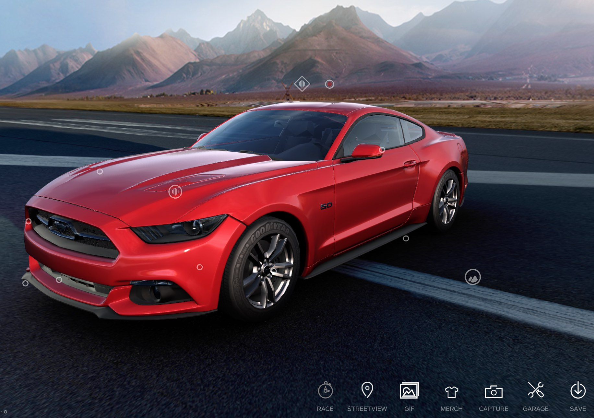

 # Product Visualization



## Get Started

In order to get the reqired libraries launch the command in the project root folder:

```
    npm install
```


## The Baseline

The idea is to build an **interactive environment** able to visualize a hierarchical model, inspect its components and test animations ([see also GLTF animations](https://github.com/mrdoob/three.js/blob/master/examples/webgl_skinning_simple.html)).


## Further developments and ideas

Improove UI and UX.


## The Team

* Edoardo Lenzi
* Marco Iuri


## Branching Strategy and Agile Pattern

We will follow the **Agile** pattern and best practices, in particular we adopt stand-up meetings and a public [Trello blackboad](https://trello.com/b/AnqGxlwx/product-configuration) to track tasks and issues. 

The applied branching strategy is **feature-oriented** so we have a branch for every single task and the main/static branches are `master` and `dev` following the standards that we can find in any enterprise working environment. Finally any merge will be made by a **pull request**. 


### Naming conventions and best practices

We adopt:

* [kebab-case](https://it.wikipedia.org/wiki/Kebab_case) for file, folder and branch names 
* [CamelCase](https://en.wikipedia.org/wiki/Camel_case) for functions and methods 
* [lowerCamelCase](https://www.w3schools.com/JS/js_conventions.asp) for variables

accordingly with the native project setup. 

We have tried to split the script on multiple files and use the 
object oriented paradigm, where possible.


### See Also

* [Guide Lines](guide-lines.md)
* [Journey](journey.md)
* [Final Report](final-report.md)


### Disclamer 

* The material contained in these project is restricted to students/professors of the 3D Interactive course of the Master of Computer Scienceat the University of Udine.

* It prohibited any use other than that inherent to the course, and in particular is expressly prohibited its use for any commercial purposes and/or for profit.


### Credits

We mainly take inspiration by the following threeJs examples:
* TODO

Every asset used was made manually by the team exept for the assets finded at fork time used for the code snippets.


### Libraries

* three.min.js
* stats.min.js
* dat.gui.min.js
* Coordinates.js
* OrbitControls.js
* PointerLockControls.js