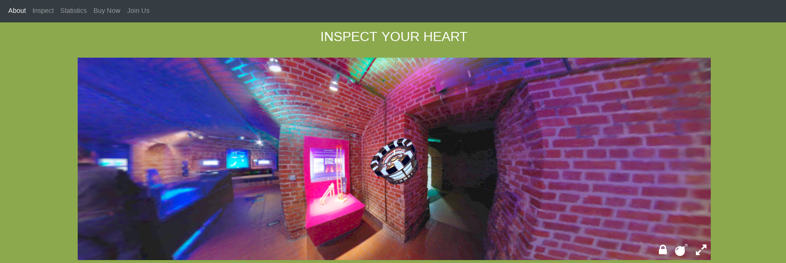
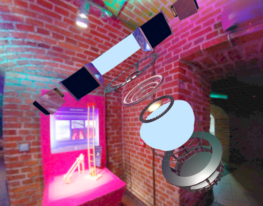
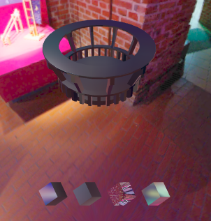

 # Product Visualization

The aim of this paper is to describe how to use our implementation (deployment, application work-flow) and general informations about the team and the development (best practices adopted, branching strategy, agile development, etc.)


<br/><br/>

---
## Get Started - Deployment

In order to setup our implementation first clone (or download) this repository with the following command:

```{sh}
git clone https://github.com/interactive3dgraphicscourse-uniud-2019/product-configuration-2019-iuri-lenzi.git
```
Open the repository root folder 

```{sh}
cd product-configuration-2019-iuri-lenzi
```

Then download the required libraries with:

```
    npm install
```

> We use `npm` as package manager for this project but feel free to manually setup the required libraries (that are only 4) described in the `package.json` file 
```{json}
  "dependencies": {
    "bootstrap": "^4.3.1",
    "font-awesome": "^4.7.0",
    "jquery": "^3.4.1",
    "slicknav": "^1.0.8"
  }
```

Once you get all the required libraries the project is ready to start, the entry point is the `index.html` file. The deployment on any server is immediate (you can use any web server framework like [Apache2](https://httpd.apache.org/) `HTTP server` or even [python3](https://www.python.org/download/releases/3.0/) `http.server` for testing puroposes).
<br/><br/>

---
## Application Work-Flow

The entry point `index.html` contains the definition of a responsive web site with an embedded `THREE.js` canvas in the middle (called `main view` or `arc-reactor view`).



<div style="display:flex; text-align:center">
    <p>Main view presents a command bar with three icons &thinsp; </p>
    
</div>

* **The rightmost** for starting the **full screen mode**
* **Bomb icon** triggers the **mesh explosion**
* **Lock icon** triggers the **sceen lock** (avoid noisy event overlapping when working on the canvas)

<div style="text-align: center;">


<em>When the bomb is pressed the mesh will explode</em></div>

Moreover the canvas has an integrated `orbit-control` that allows to **rotate and zoom** the arc-reactor; thanks to a `ray caster` is possible to **click on any mesh component to inspect it**.

<div style="text-align: center;">


<em>Once a component is inspected a second scene will appear</em></div>

Under the inspected components 2 or more cubes with different materials will appear; click on a cube in order to change the inspected object material (the update is persistent and will affect also the main view once the inspector scene will be closed with the "`X`" icon)

<br/><br/>

---

## The Team

* Edoardo Lenzi
* Marco Iuri

<br/><br/>

---
## Branching Strategy and Agile Pattern

We will follow the **Agile** pattern and best practices, in particular we adopt stand-up meetings and a public [Trello blackboad](https://trello.com/b/AnqGxlwx/product-configuration) to track tasks and issues. 

The applied branching strategy is **feature-oriented** so we have a branch for every single task and the main/static branches are `master` and `dev` following the standards that we can find in any enterprise working environment. Finally any merge will be made by a **pull request**. 


### Naming conventions and best practices

We adopt:

* [kebab-case](https://it.wikipedia.org/wiki/Kebab_case) for file, folder and branch names 
* [CamelCase](https://en.wikipedia.org/wiki/Camel_case) for functions and methods 
* [lowerCamelCase](https://www.w3schools.com/JS/js_conventions.asp) for variables

accordingly with the native project setup. 

We have tried to split the script on multiple files and use the 
object oriented paradigm, where possible.

<br/><br/>

---
## See Also

* [Guide Lines](guide-lines.md)
* [Journey](journey.md)
* [Final Report](final-report.md)

<br/><br/>

---
## Disclamer 

* The material contained in these project is restricted to students/professors of the 3D Interactive course of the Master of Computer Scienceat the University of Udine.

* It prohibited any use other than that inherent to the course, and in particular is expressly prohibited its use for any commercial purposes and/or for profit.

<br/><br/>

---
## Credits

We mainly take inspiration by the following `THREE.js` examples:
* [webgl materials envmaps](https://threejs.org/examples/?q=map#webgl_materials_envmaps)
* [webgl raycast sprite](https://threejs.org/examples/?q=cast#webgl_raycast_sprite)

Every asset used was made manually by the team exept for:
* the assets finded at fork time 
* the environment map taken from [texturify.com](texturify.com)
* the [base texture](https://ak3.picdn.net/shutterstock/videos/5049173/thumb/1.jpg) for the coils


### Libraries

* three.min.js
* stats.min.js
* OrbitControls.js
* BufferGeometryUtils.js
* GLTFLoader.js
* Tween.js

#### npm dependencies

* Modernizr
* Bootstrap 4
* JQuery
* FontAwesome